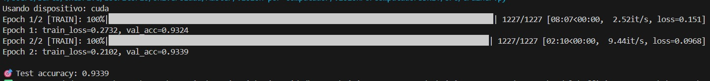
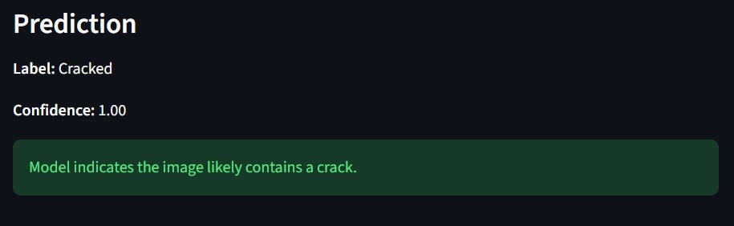
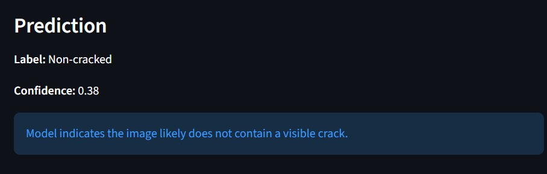

# Project Memory — VisionPorComputadorSDNET

This file is a short, blog-like memory of the project as it evolved. It documents major decisions, experiments, and milestones so the project's path is clear.

## Timeline

- **Data & setup** — Collected and organized SDNET images into `data/` with categories for `Pavements`, `Walls`, and `Decks`, split into `Cracked` and `Non-cracked`.
- **Baseline CNN** — Trained a convolutional neural network to classify `cracked` vs `non-cracked` images using a standard architecture (e.g., ResNet-based transfer learning). Saved final model artifacts to `models/`.
- **Evaluation** — Measured accuracy, precision, recall, and visualized incorrect predictions. Iterated on augmentations to reduce overfitting.
- **Web demo** — Built a Streamlit app (`web/app.py`) so users can upload images and test the model locally.
- **Deployment** — Plan to deploy the web demo to Streamlit Community Cloud (or another host) so the demo is accessible without cloning the repository.

## Progress

We have created a Neural Network that detects if an image from SDNET is cracked or not cracked. In our first trials we can observe and accuracy of around 0.93%. We will be working on improving this model.

The dataset is split into:

-**70% training**

-**15% validation**

-**15% testing**

Using a shuffled sample list before splitting ensures that performance metrics reflect generalization and not memorization.

Using this code we where able to detect cracks, as illusteated in the following images.

- **Cracked** 

- **UnCracked**

###  Next Steps

1. Use classical computer vision techniques for pre or post processing allowing for more accurate results.

1. Train other models in order to compare and verify wich one has greater accuracy.

1. Submit a full report on the model, website and classical techniques used for the development of this project.

## Notes & Future Work

- Add more model-agnostic preprocessing to the web app so it can accept different input sizes and color channels.
- Create an automated CI step to export model artifacts to `models/` and version them.
- Add explanations / Grad-CAM visualizations to show which image regions the model used for predictions.

## How I used this file

Use this file to jot short notes about experiments, dates, or decisions. When deploying, copy selected entries into the public project blog or release notes.
