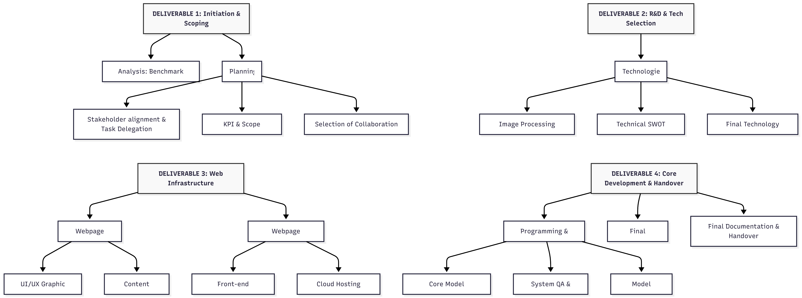
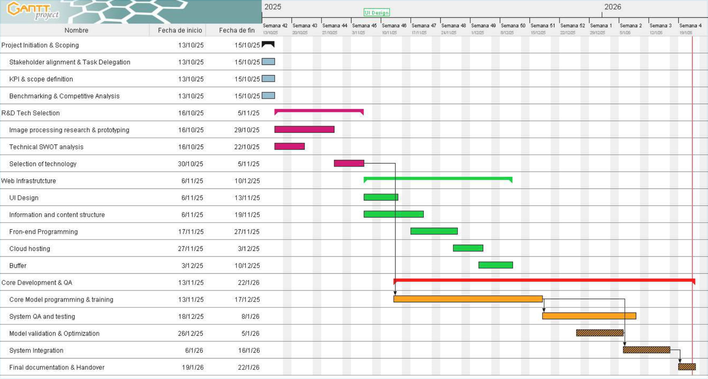

# Project Memory — VisionPorComputadorSDNET

This file is a short, blog-like memory of the project as it evolved. It documents major decisions, experiments, and milestones so the project's path is clear.

## Planning

This chapter shows how we planned the project. It includes our main goals (Deliverables), how the tasks are organized, and the schedule (Gantt chart). The project starts on October 13, 2025, and finishes on January 23, 2026.

### Deliverables

We divided the project into four main parts or "Deliverables." Each one has a specific deadline and a list of tasks we need to complete.

- **Deliverable 1 (October 15th)**: Setting up the project and the team.
  - Project Initiation & Scoping
  - Stakeholder alignment & Task Delegation
  - KPI & scope definition
  - Benchmarking & Competitive Analysis

- **Deliverable 2 (November 5th)**: Researching the technology and tools we need.
  - Image processing research & prototyping
  - Technical SWOT analysis
  - Selection of technology

- **Deliverable 3 (December 10th)**: Designing and building the website.
  - UI Design
  - Information and content structure
  - Front-end Programming
  - Cloud hosting
  - Buffer period (extra time for fixes)

- **Deliverable 4 (January 22nd)**: Programming the AI model, testing everything, and final delivery.
  - Core Model programming & training
  - System QA and testing
  - Model validation & Optimization
  - System Integration (connecting the model to the web)
  - Final documentation & Handover

#### Work Breakdown Structure

The chart below shows how the tasks are grouped under each deliverable. This helps us see the structure of our work.

#### Gantt Diagram

We use a Gantt chart to track the dates and make sure we finish on time. The chart below shows the weekly schedule. We can see that in November, we start working on the website and the AI model at the same time to save time.

## Methodology

The methodology followed in this project consists of several stages designed to compare the performance of classical computer vision and artificial intelligence techniques for detecting structural defects in concrete images from the SDNET 2018 dataset.

Whether using classical methods or machine learning methods, the tools we develop are always divided into two main parts:

#### Preprocessing

A preprocessing of the sample image is performed to obtain a representation of the features that are best processed by our classifier. Preprocessing techniques vary depending on the type of classifier being used, but a few are considered the baseline for computer vision: Grayscale, Gaussian Blur, and Normalization—some of which we used in our project and will be further developed in a dedicated section (see Section on Preprocessing).

In our case, the edge detection methods used for the classical approach (Canny and Sobel edge detectors) can also be considered a form of preprocessing, acting as feature extractors of the sample vectors. They were chosen because our research on the task indicated them to be simple and efficient (see Section on State-of-the-Art).

#### Classifier

*(Details to be added here, same as in LaTeX placeholder)*

#### Metrics

In order to compare the different methods we use to classify samples of SDNET as **Cracked** or **Uncracked**, we need to implement metrics that stay relevant across our different models, from classical methods to heuristics or even machine learning.

- To evaluate the sensitive aspect of our tools (the ability to accurately recognize a cracked image as such), the first metric of interest is the frequency of true positives: the positive predictive value (PPV):

$$
\text{Precision}_{\text{category}} =
\frac{\text{TrueCracked}_{\text{category}} + \text{TrueUncracked}_{\text{category}}}
{|\text{Category}|}
$$

But sensitivity alone is not enough to guarantee a good classifier: a tool that labels all images as Cracked would yield maximum sensitivity.

- We also need to consider the overall precision of the tools we develop. It can be useful to separate this precision according to the different categories:

$$
\text{Precision}_{\text{category}} =
\frac{\text{TrueCracked}_{\text{category}} + \text{TrueUncracked}_{\text{category}}}
{|\text{Category}|}
$$

However, the asymmetry of the dataset used (SDNET 2018, see Section on Dataset) with only 30% of the images actually being cracked means that focusing on this 30% might lower the precision of the classifier on the other 70% of the dataset.

- The time needed to implement and use the tool also serves as a minor metric. This is among other reasons why we attempted classical methods first: they don't require training time or a dataset.

# Summary: Computer Vision for Crack Detection in Concrete

## Task Definition
- Cracks are early signs of structural damage in concrete surfaces.  
- Manual inspection is subjective, slow, and lacks quantitative analysis.  
- Automated image-based detection is proposed to improve objectivity and efficiency.  
- Priority: avoid false negatives (missed cracks) even if false positives occur (manual verification).

## Classical Methods
### Sobel Edge Detection
- Treat cracks as edges on grey, smooth concrete.  
- Vertical and horizontal edge kernels applied.  
- Aggregation by quadratic mean.  
- Thresholding to classify images as cracked/uncracked.  
- Limitations: global roughness can cause false edges.

### Canny Edge Detection
- Steps:
  1. Gaussian smoothing  
  2. Gradient detection (Sobel method)  
  3. Non-maximum suppression (thin edges)  
  4. Double thresholding (strong, thin, null edges)  
  5. Hysteresis (thin edges retained only if connected to strong edges)  
- Reduces unwanted detections caused by concrete roughness.

## Convolutional Neural Network (CNN) Classifier
- Input: images; goal: recognize and locate cracks.  
- Convolutional layers detect visual patterns; deeper layers generalize features.  
- Architecture:
  - Data preprocessing (flattening, adaptive averaging)  
  - Four convolutional groups: Convolution → Batch Norm → ReLU → MaxPooling  
  - Fully connected output layer for crack probability  
- Benefits:
  - Learns to differentiate cracks from roughness or outliers.  
  - Potentially higher accuracy and robustness than classical methods.

## Key Metrics
- Sensitivity: detect true cracks (avoid false negatives).  
- Precision: overall correctness across categories.  
- Computational efficiency: classical methods are fast, CNNs require training.  

## Conclusion
- Classical methods are simple and interpretable but limited by surface roughness.  
- CNNs offer scalable, adaptive crack detection with improved sensitivity and precision.  
- Combining automated detection with human verification ensures reliability for structural assessment.

# Computer Vision: Crack Detection in Concrete Surfaces

## I – Defined Task

Cracks on concrete surfaces are among the first signs of structural damage when exposed to the environment. Manual inspection is the traditional method for crack detection, where a sketch of the crack is prepared manually and the irregularities are recorded by an on-site technician. This method is entirely dependent on the technician’s knowledge, habits, and experience, which makes it subjective and limits quantitative analysis.  

Automatic image-based crack detection is naturally proposed as a replacement, highlighting the importance of Computer Vision in this problem. The presence of cracks weakens structures such as buildings, bridges, and roads, reducing their ability to safely withstand loads.  

Given the task and potential consequences, it is preferable to identify an **uncracked image as cracked** (triggering a manual verification) rather than the opposite (risking leaving fissures unchecked). Manual verification is already a specific test, reinforcing the need for a sensitive detection method, especially given the data volume of each class.

---

## II – Classical Method Attempts

### Convolution: Sobel Edge Detection

- Cracks are treated as edges on an otherwise grey, smooth concrete surface.  
- Convolution kernels used:

- Vertical and horizontal borders are detected while integrating slight smoothing to reduce artifacts.  
- Aggregation: vertical and horizontal edges are merged using a **quadratic mean** to avoid halving intensities.  
- Classification: threshold applied to determine cracked/uncracked status, prioritizing sensitivity.  
- Limitation: global roughness of concrete may cause false edge detections; additional smoothing may be required.

### Canny Edge Detection

Canny detection consists of five steps:

1. **Smoothing**  
   - Gaussian blur reduces surface roughness, suppressing unnecessary edges.  

2. **Gradient Detection (Sobel method)**  
   - Detect vertical and horizontal edges through convolution, followed by aggregation.  

3. **Non-Maximum Suppression**  
   - Only pixels that are local maxima are retained, resulting in thinner edge lines.  

4. **Double Thresholding**  
   - Remaining pixels classified as strong edges, thin edges, or null:  
     - If p > Tstrong → strong edge  
     - If Tthin ≤ p ≤ Tstrong → thin edge  
     - If p < Tthin → null  

5. **Hysteresis**  
   - Thin edges retained only if adjacent to strong edges.  

- Goal: reduce false detections caused by concrete roughness.  
- Crack classification: thresholding the number of edge pixels in the image.

---

## III – Convolutional Neural Network (CNN) Classifier

- **Input:** images of concrete surfaces  
- **Goal:** recognize and locate cracks as visual patterns (groups of pixels)  
- CNN uses convolutional layers with trainable kernels; deeper layers generalize features for complex patterns.  

### Architecture

1. **Data Preprocessing**  
   - Flattening operation  
   - Adaptive averaging layer for input normalization to account for variations in image conditions  

2. **Convolutional Groups (4 blocks)**  
   Each block contains:
   - 2D Convolution layer (linear combination of 3x3 neighboring pixels)  
   - Batch Normalization (normalize color/lighting variations)  
   - ReLU activation  
   - MaxPooling 2D (reduce feature map dimensions)  

3. **Fully Connected Layer**  
   - Reduces output space to scalar probabilities of crack presence  

- The CNN learns to differentiate cracks from surface roughness or outliers.  
- Potential problematic outliers are handled via the network’s ability to generalize patterns.

### Metrics

- **Sensitivity:** ability to detect true cracks:

\[
\text{Sensitivity} = \frac{\text{TrueCracked}}{\text{TrueCracked} + \text{FalseUncracked}} = \frac{\text{TrueCracked}}{\text{ActuallyCracked}}
\]

- **Precision:** overall classifier accuracy per category:

\[
\text{Precision}_{\text{category}} = \frac{\text{TrueCracked}_{\text{category}} + \text{TrueUncracked}_{\text{category}}}{|\text{Category}|}
\]

- **Time efficiency:** classical methods are fast with no training; CNNs require training time.

---

## IV – Summary

- **Classical methods**: Sobel and Canny edge detection are simple and interpretable but limited by concrete surface roughness.  
- **CNN approach**: adaptive, capable of learning feature patterns, higher sensitivity, and better handling of complex surfaces.  
- **Hybrid approach**: automated detection paired with manual verification ensures reliability.  

**Next step:** insert confusion matrix results to quantify CNN performance.

### ResNet-18 for Crack Detection

This section explains how the neural network was trained to detect cracks in images. We used a **transfer learning** approach with a ResNet-18 model, starting from a model already trained on a large dataset and adapting it to our specific problem.

#### Model Architecture and Features
- **Pre-trained backbone:** ResNet-18 pre-trained on ImageNet, reusing low-level features such as edges, textures, and basic shapes.  
- **Modified output layer:** Original ResNet-18 classified 1,000 classes; for binary crack detection, the final fully connected layer was replaced with a single output representing presence or absence of a crack.  
- **Access to convolutional layers for Grad-CAM:** The last convolutional block (`layer4`) is exposed for generating Grad-CAM visualizations to interpret model decisions.

#### Data Preparation and Splitting
Dataset split to ensure generalization:
- **Training set (70%):** Used to train the model and update weights.  
- **Validation set (15%):** Monitors performance and detects overfitting.  
- **Test set (15%):** Evaluates final performance on unseen images.

#### Training Strategy and Optimization
- Optimizer: Adam  
- Learning rate: \(1 \times 10^{-4}\) (fine-tuning pre-trained weights)  
- Trained for 2 epochs  

| Setting          | Value              |
|-----------------|------------------|
| Optimizer       | Adam             |
| Learning rate   | 0.0001           |
| Loss function   | BCEWithLogitsLoss|
| Batch size      | 32               |
| Input image size| 224 × 224        |

#### Data Augmentation and Input Processing
- **Random horizontal flipping:** Applied to training set to increase variability and orientation invariance.  
- **Normalization:** ImageNet-based preprocessing to align with pre-trained convolutional features.

---

### EfficientNet-B0 for Crack Detection

A **transfer learning** approach using EfficientNet-B0 was applied. A pre-trained model was adapted to the crack detection task.

#### Model Architecture and Features
- **Pre-trained backbone:** EfficientNet-B0 pre-trained on ImageNet to reuse general visual features like edges, textures, and shapes.  
- **Modified classifier:** Original 1,000-class output replaced with a single output for binary crack detection.

#### Data Preparation and Splitting
- **Training set (70%):** Used for model training.  
- **Validation set (15%):** Monitors performance during training.  
- **Test set (15%):** Evaluates final performance.

#### Training Strategy and Optimization
- Optimizer: Adam  
- Learning rate: \(1 \times 10^{-4}\)  
- Trained for 2 epochs  

| Setting          | Value              |
|-----------------|------------------|
| Optimizer       | Adam             |
| Learning rate   | 0.0001           |
| Loss function   | BCEWithLogitsLoss|
| Batch size      | 32               |
| Input image size| 224 × 224        |

#### Data Augmentation and Input Processing
- **Random horizontal flipping:** Applied to training data to increase diversity.  
- **Normalization:** Images normalized using ImageNet preprocessing to ensure compatibility with pre-trained EfficientNet-B0.

## Timeline

- **Data & setup** — Collected and organized SDNET images into `data/` with categories for `Pavements`, `Walls`, and `Decks`, split into `Cracked` and `Non-cracked`.
- **Baseline CNN** — Trained a convolutional neural network to classify `cracked` vs `non-cracked` images using a standard architecture (e.g., ResNet-based transfer learning). Saved final model artifacts to `models/`.
- **Evaluation** — Measured accuracy, precision, recall, and visualized incorrect predictions. Iterated on augmentations to reduce overfitting.
- **Web demo** — Built a Streamlit app (`web/app.py`) so users can upload images and test the model locally.
- **Deployment** — Plan to deploy the web demo to Streamlit Community Cloud (or another host) so the demo is accessible without cloning the repository.

## Progress

We have created a Neural Network that detects if an image from SDNET is cracked or not cracked. In our first trials we can observe and accuracy of around 0.93%. We will be working on improving this model.

The dataset is split into:

-**70% training**

-**15% validation**

-**15% testing**

Using a sample before splitting ensures that performance metrics reflect generalization and not memorization.

Using this code we where able to detect cracks, as illusteated in the following images.

- **Cracked** 

- **UnCracked**

###  Next Steps

1. Use classical computer vision techniques for pre or post processing allowing for more accurate results.

   In this sense we've begun to use thresholding and we expect to be able to use it to improve our model.

   

1. Train other models in order to compare and verify wich one has greater accuracy.

1. Submit a full report on the model, website and classical techniques used for the development of this project.
